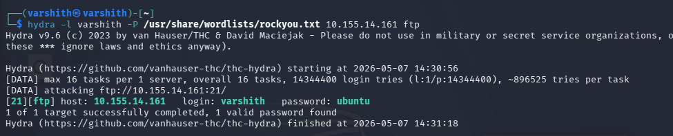
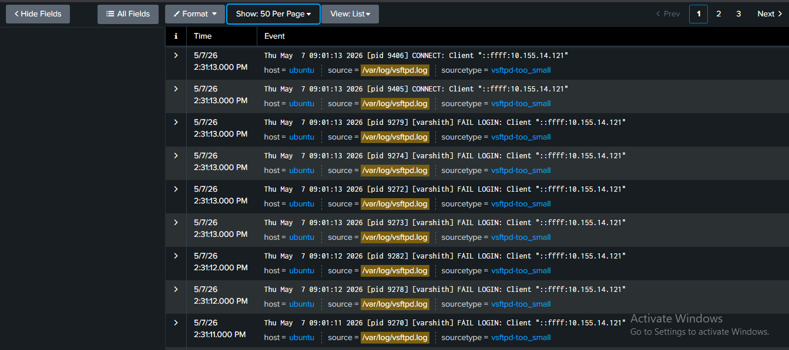
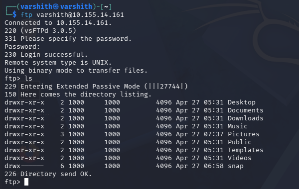
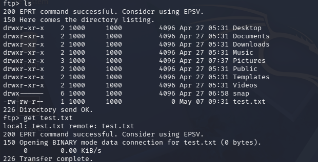
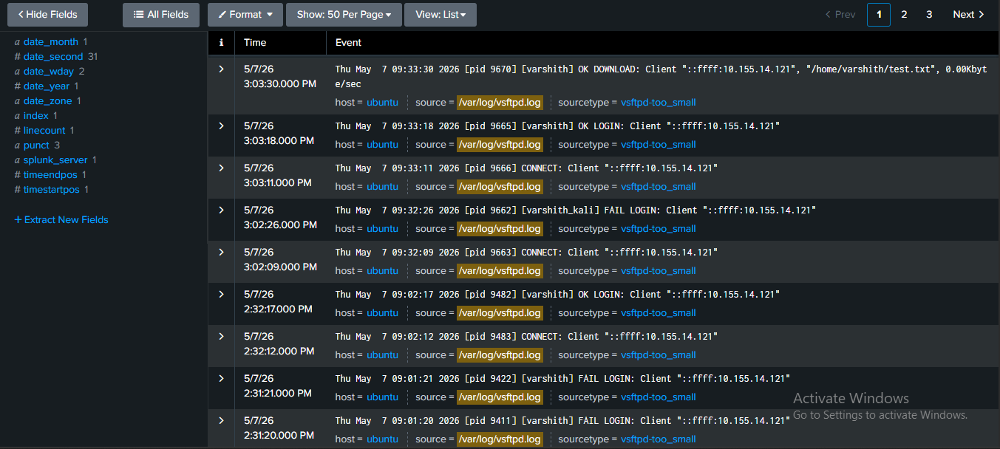

# FTP Brute Force Attack - Documentation

## Overview

FTP (File Transfer Protocol), as the name suggests, is used for transferring files. Unlike SSH, FTP only allows the user to upload or download files from the server to the device the connection is made from. Attackers use tools like Hydra, Medusa, Ncrack, or even Nmap scripts to perform brute force attacks to obtain passwords.

---

## Step 1: Brute Forcing the FTP Password with Hydra

The following command was used to perform the brute force attack:

```
hydra -l <username> -P <password_wordlist> <target_ip> ftp
```

In this case:

```
hydra -l varshith -P /usr/share/wordlists/rockyou.txt 10.155.14.161 ftp
```



From the output, it can be observed that the password has been successfully compromised for the FTP server. Hydra found the valid credentials:

- **Username:** varshith  
- **Password:** ubuntu

---

## Step 2: Observing the Logs - Failed Login Attempts

Before connecting to the server, it is important to observe the logs from the defender's perspective.



The logs show a large number of failed connection attempts from the same IP address (`::ffff:10.155.14.121`). This is because Hydra was cycling through passwords until it found the correct one.

From a **defender's perspective**, this behavior indicates:

- Multiple failed logins from the same IP address in a short time window
- A clear sign of a brute force attack in progress
- Once the correct password is found, Hydra stops and the attacker gains access

Since the attacker now has the valid credentials, they can connect to the FTP server and upload or download files. If FTP is not configured properly, there is also a risk of the attacker navigating to other sensitive directories on the system.

---

## Step 3: Connecting to the FTP Server

Using the compromised credentials, the attacker connects to the FTP server and lists the directory contents.



The attacker successfully authenticates and gains access to the user's home directory, which contains folders such as Desktop, Documents, Downloads, Music, Pictures, and more.

---

## Step 4: Downloading Files from the Server

The attacker identifies a file of interest (`test.txt`) and downloads it using the `get` command.



The file is transferred successfully from the target machine to the attacker's system. This demonstrates how an attacker can exfiltrate sensitive data once FTP credentials are compromised.

---

## Step 5: Logs Confirming the Download

The download activity is captured in the FTP server logs located at `/var/log/vsftpd.log`.



The logs clearly show the full attack chain:

1. Noticible amount of  `FAIL LOGIN` entries from the same IP address in a short time window during the brute force phase
2. A successful `OK LOGIN` entry once the correct password was found which was followed by the burst of failed attempts
3. An `OK DOWNLOAD` entry showing the file `/home/varshith/test.txt` was exfiltrated

To prevent this using fail2ban is recomended which automatically updates the system firewall to block the IP after a defined number of failed login attempts, and it is recomemded to avoid using ftp and opting for better secure protocols such as SFTP or FTPS 
