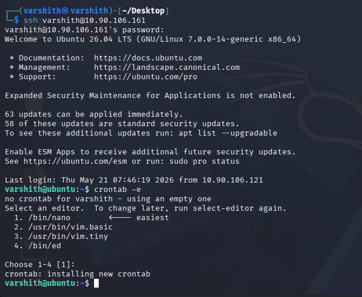
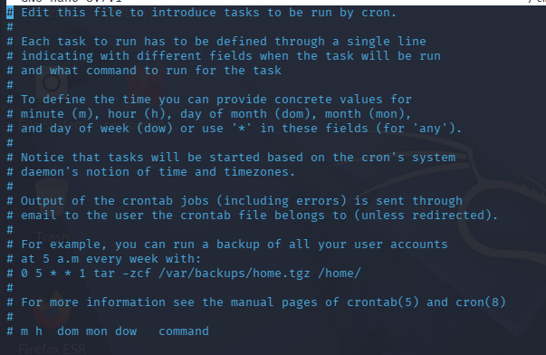
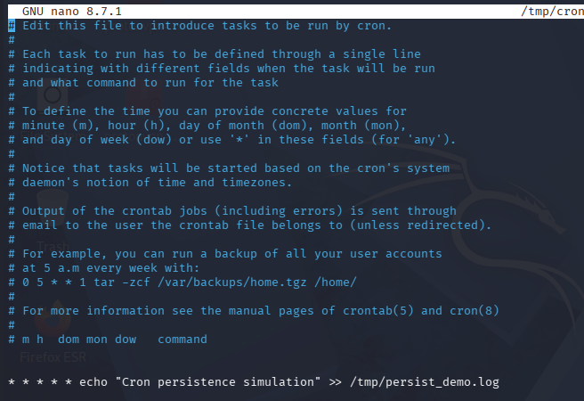
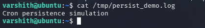
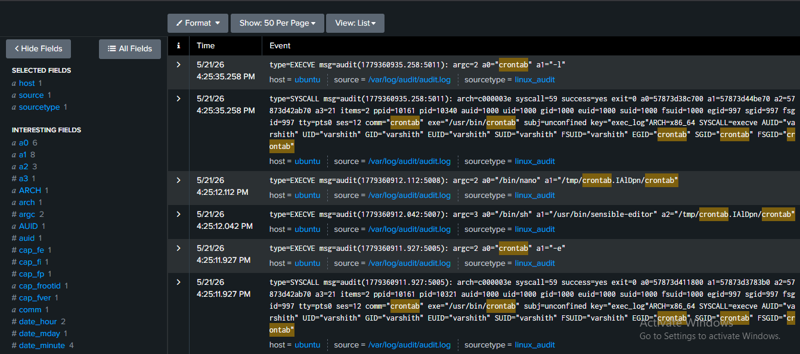
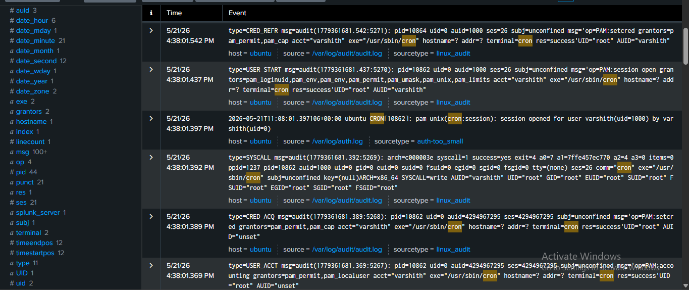

# Cron Job Persistence Attack 

A Cron Job Persistence Attack is a technique used by attackers to maintain long-term access to a compromised Linux or Unix-based system. After gaining initial access, an attacker plants a malicious command inside the system's cron scheduler, which automatically executes commands at defined time intervals. Because cron jobs run silently in the background and are often overlooked during routine system checks, this method allows an attacker to re-establish access, exfiltrate data, or execute payloads repeatedly, even after the initial intrusion vector has been discovered and closed.

This technique falls under the MITRE ATT&CK framework as **T1053.003 - Scheduled Task/Job: Cron** and is classified as a persistence mechanism.

## Step 1: SSH into the Target Machine

The attacker connects to the target Ubuntu machine over SSH using valid credentials.

```bash
ssh varshith@10.90.106.161
```

After successful authentication, the system presents the Ubuntu 26.04 LTS welcome banner. The banner reveals that 63 updates are pending, including 58 security updates, which indicates a slightly neglected system - a common real-world scenario. Once logged in, `crontab -e` is run immediately to begin planting the persistence mechanism.

Since no crontab exists yet for this user, the system responds with `no crontab for varshith - using an empty one` and prompts to select a text editor. Option 1 (`/bin/nano`) is chosen as it is the most straightforward.

```bash
crontab -e
```

The system confirms: `crontab: installing new crontab`




## Step 2: Understanding the Crontab File Structure

Once the nano editor opens, the default crontab template is displayed with commented instructions explaining how to define scheduled tasks. The format for a cron job entry is:

```
m  h  dom  mon  dow  command
```

| Field | Meaning       | Accepted Values               |
|-------|---------------|-------------------------------|
| m     | Minute        | 0 - 59                        |
| h     | Hour          | 0 - 23                        |
| dom   | Day of Month  | 1 - 31                        |
| mon   | Month         | 1 - 12                        |
| dow   | Day of Week   | 0 - 7 (both 0 and 7 = Sunday) |

A `*` in any field means "every" - for example, `* * * * *` means every minute of every hour of every day.




## Step 3: Planting the Persistence Payload

At the bottom of the crontab file, the following malicious entry is added. This line runs every minute and appends a string to a log file, simulating a persistence beacon. In a real attack, this command could be a reverse shell, a download-and-execute payload, or a credential harvester.

```bash
* * * * * echo "Cron persistence simulation" >> /tmp/persist_demo.log
```

The `* * * * *` schedule ensures the command executes once every minute, continuously, without any further user interaction.




## Step 4: Verifying the Payload Executed

After saving the crontab and waiting for the cron daemon to trigger the job, the output file is checked to confirm successful execution.

```bash
cat /tmp/persist_demo.log
```

Output:
```
Cron persistence simulation
```

The file exists and contains the expected string, confirming the cron job ran successfully in the background without any user interaction.




## Step 5: Detection in Splunk - Crontab Write Events

Switching to the detection side, Splunk is used to investigate audit logs collected from the target machine at `/var/log/audit/audit.log`. Searching for events referencing `crontab` reveals a clear sequence of audit events timestamped around the time of the attack (5/21/26 ~4:25 PM):

- `type=EXECVE` with `a0="crontab"` and `a1="-l"` - the crontab binary was invoked
- `type=SYSCALL` showing `exe="/usr/bin/crontab"` with `comm="crontab"` and `success=yes` - the syscall completed successfully
- `type=EXECVE` with `a0="/bin/nano"` opening the crontab temp file at `/tmp/crontab.IAlDpn/crontab` - the editor was launched
- `type=EXECVE` with `a0="/bin/sh"` and `a1="/usr/bin/sensible-editor"` - the shell was used to select and launch the editor
- `type=EXECVE` with `a0="crontab"` and `a1="-e"` - the initial edit invocation

All events are tied to `AUID="varshith"` and `UID="varshith"`, clearly identifying the user who created the cron entry.




## Step 6: Detection in Splunk - Cron Daemon Execution Events

A second cluster of Splunk events captured around 4:38 PM shows the cron daemon (`/usr/sbin/cron`) picking up and executing the scheduled job. Key events include:

- `type=CRED_REFR` - PAM credentials refreshed for user `varshith` via cron
- `type=USER_START` - PAM session opened by cron on behalf of `varshith`
- `pam_unix(cron:session): session opened for user varshith(uid=1000) by varshith(uid=0)` - visible in `/var/log/auth.log`
- `type=SYSCALL` with `comm="cron"` and `exe="/usr/sbin/cron"` - the cron binary executed a write syscall with `success=yes`
- `type=CRED_ACQ` and `type=USER_ACCT` - PAM credential acquisition and account validation for the cron session

These events confirm the cron daemon authenticated and ran the planted job. The presence of these PAM session events for an unexpected or unauthorized cron entry is a strong indicator of persistence activity.




## Key Takeaways

- Cron job persistence is a low-noise, high-impact technique that survives system reboots and user logouts.
- On Linux systems with `auditd` enabled, every `crontab` invocation generates EXECVE and SYSCALL audit events that can be forwarded to a SIEM like Splunk for analysis.
- When the cron daemon executes a job, it opens a PAM session which generates auth log events, providing a second independent detection opportunity.
