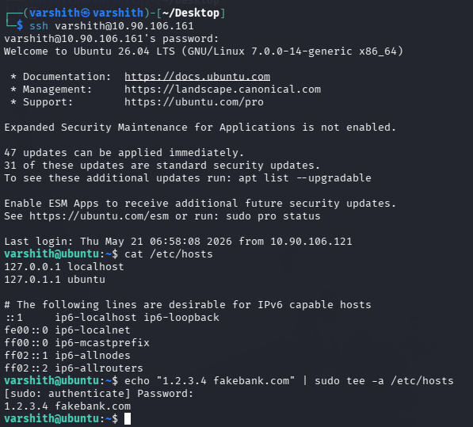
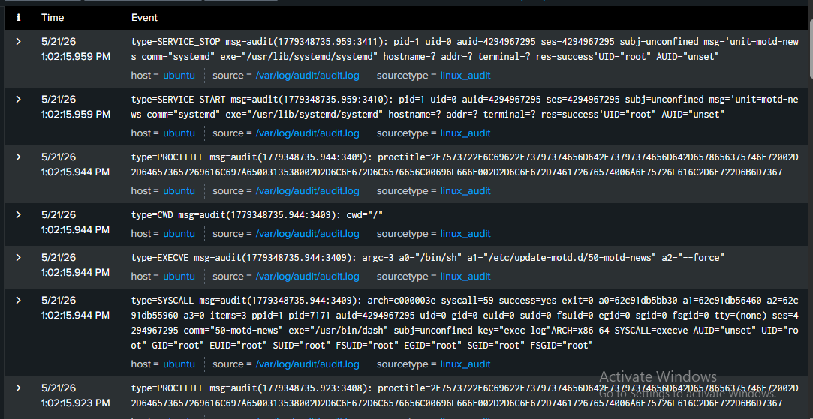
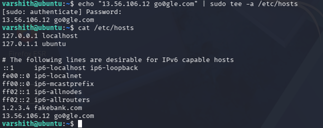
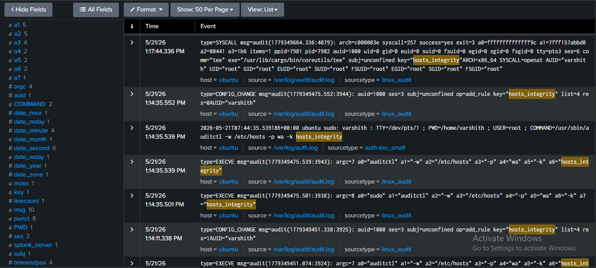
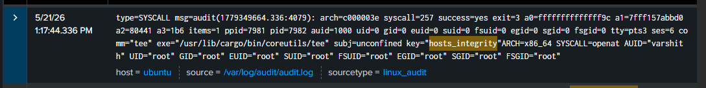
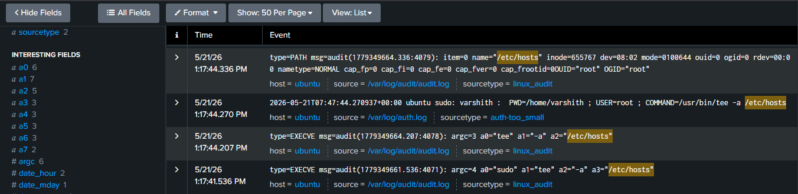

# File Integrity Tampering Attack Detection Using Auditd and Splunk

## Introduction

File integrity tampering is a class of attack where an adversary modifies critical system files to alter system behavior, redirect network traffic, or establish persistence. One of the most targeted files on a Linux system is `/etc/hosts`, which maps hostnames to IP addresses. By injecting malicious entries into this file, an attacker can silently redirect DNS lookups for legitimate domains to attacker-controlled infrastructure, enabling phishing, credential harvesting, or man-in-the-middle attacks.

This type of attack is particularly dangerous because it operates at the OS level, bypassing application-layer DNS protections and leaving minimal traces in standard system logs. The attack is stealthy, low-noise, and can persist across reboots without any obvious indicators.

This document walks through a practical demonstration of the attack, the absence of detection in default logging, and how auditd combined with Splunk can be used to reliably detect and investigate such tampering.

---

## 1. Performing the Attack via SSH

The attack begins by gaining access to the target machine over SSH. Once logged in, the adversary appends a fraudulent hostname mapping to `/etc/hosts` using the `tee` command with elevated privileges.

In this demonstration, the attacker maps `fakebank.com` to the IP `1.2.3.4`, effectively hijacking any local resolution of that domain.



At this stage, the entry has been successfully written to the file. The system is now compromised in terms of hostname resolution, but no specific alert has been triggered.

---

## 2. Default Logs - No Detection

Without any additional monitoring configured, the default system logs do not generate meaningful or specific entries that would indicate tampering with `/etc/hosts`. The activity blends in with routine systemd and motd-related service events.

The audit log entries visible at this point are generic SERVICE_STOP, SERVICE_START, and PROCTITLE records related to system processes, with no correlation to the file write that just occurred.



This is what makes the attack dangerous in default configurations: the modification goes unnoticed, and there is no straightforward way to search or alert on it without additional instrumentation.

---

## 3. Setting Up Auditd Watch Rule for /etc/hosts

To make this attack detectable, an auditd watch rule is created on `/etc/hosts`. The rule monitors the file for write and attribute-change operations and tags all related events with the custom key `hosts_integrity`.

The rule is added using the following command:

```bash
sudo auditctl -w /etc/hosts -p wa -k hosts_integrity
```

- `-w /etc/hosts` : Watch the specified file
- `-p wa` : Trigger on write (w) and attribute change (a) operations
- `-k hosts_integrity` : Tag matching events with this key for easy search and correlation


Once this rule is active, any modification to `/etc/hosts` will generate audit log entries tagged with `hosts_integrity`, making them immediately searchable in Splunk.

---

## 4. Repeating the Attack - Second Injection

With the auditd rule now in place, the attack is repeated. A second malicious entry is appended to `/etc/hosts`, this time mapping `go0gle.com` (a typosquat domain) to `13.56.106.12`. The `cat` output confirms both the original fake entry and the new one are now present in the file.



---

## 5. Detecting the Tampering in Splunk

After the second injection, Splunk now surfaces events tagged with the `hosts_integrity` key. The audit logs clearly show the full chain of activity: the auditctl rule being added, the EXECVE records for the `tee` command, and the corresponding SYSCALL entries.

The presence of the `hosts_integrity` key in these logs confirms that the monitored file was accessed in a write operation, and the events can now be investigated, alerted on, or correlated with other activity.



---

## 6. Key Log Entry - tee Command Writing to /etc/hosts

The most critical log entry is the SYSCALL event that captures the `tee` command writing to `/etc/hosts`. This record includes the full audit context: the syscall number (257 - openat), the executable path (`/usr/lib/cargo/bin/coreutils/tee`), the `hosts_integrity` key, and the user and group context confirming it ran as root.

This single log entry is sufficient to confirm that a write to the monitored file occurred, who triggered it, and under what context.



---

## 7. Confirming the File Path - /etc/hosts

To complete the investigation, the PATH record associated with the same audit event confirms that the file written to was specifically `/etc/hosts` (inode 655767). This removes any ambiguity and directly ties the tee execution to the target file.

Additional corroborating entries include the sudo auth log showing the exact command run and the EXECVE records confirming the argument chain (`tee -a /etc/hosts`).



---

## Summary

| Stage | Observation |
|---|---|
| Attack via SSH (no auditd) | /etc/hosts modified, no specific logs generated |
| Default audit logs | Only generic systemd/motd events, no file-level visibility |
| Auditd rule added | Watch rule on /etc/hosts with key hosts_integrity |
| Attack repeated | Malicious entry injected again |
| Splunk detection | Events tagged hosts_integrity visible and searchable |
| Root cause confirmed | SYSCALL + PATH records pinpoint tee writing to /etc/hosts as root |

By combining auditd watch rules with Splunk log ingestion, what was previously an invisible attack becomes a fully traceable, alertable event. The `hosts_integrity` key acts as a reliable pivot point for threat hunting and incident response whenever /etc/hosts tampering is suspected.
