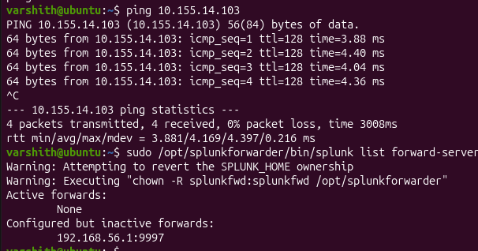
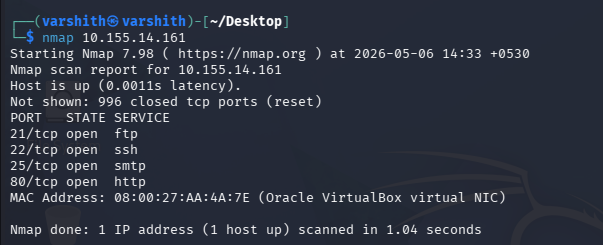
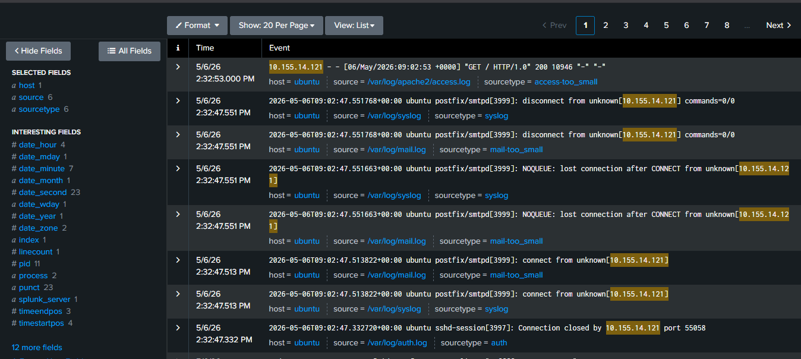
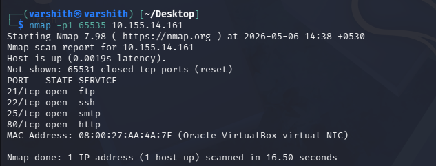
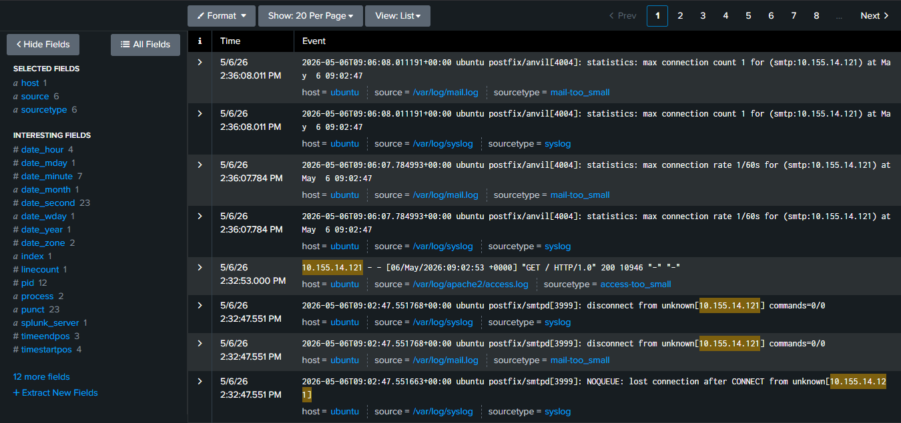
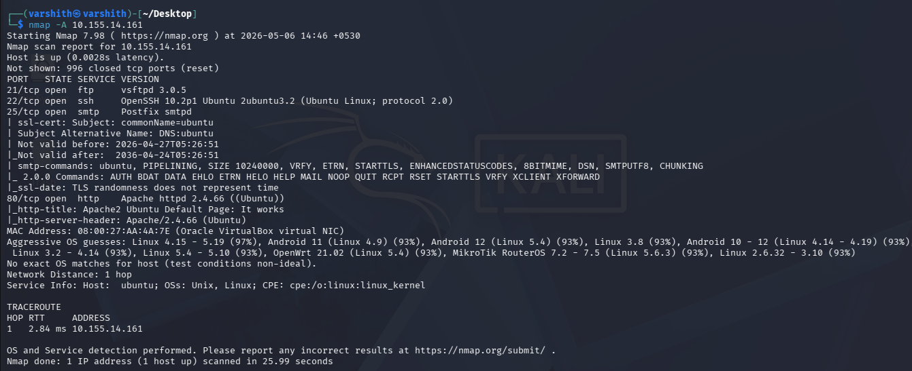
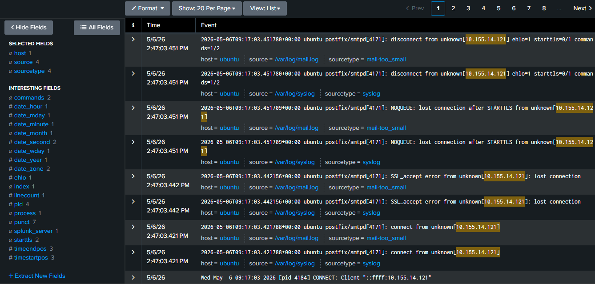
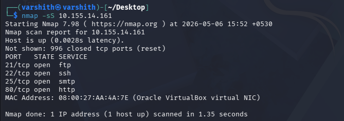
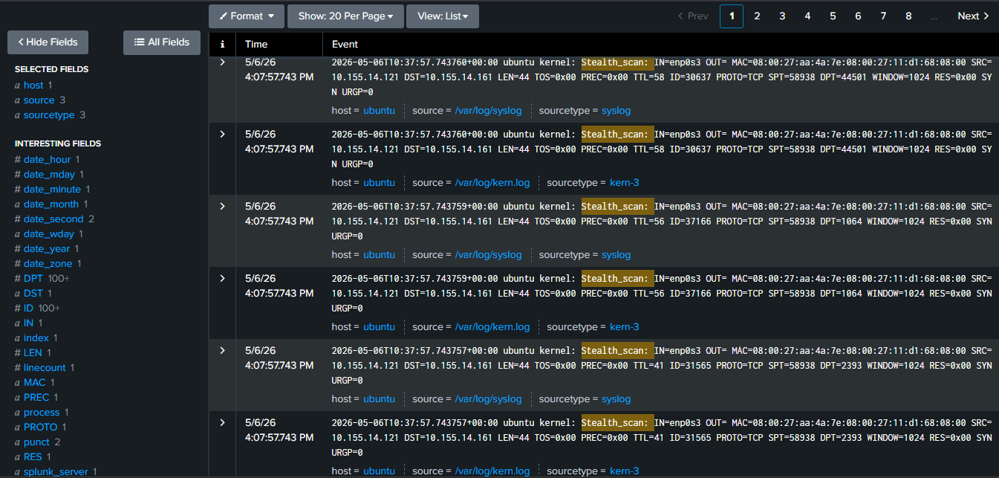

# Nmap – Reconnaissance Module

## Overview

For any attack, the initial step is always **reconnaissance (recon)**. Nmap is one such tool used to perform recon on a target. When performed, the attacker gets information on the open ports and services of the target. With proper usage of flags, they can find out more details such as the OS, versions of the services, and even run scripts to check for known vulnerabilities in the target's environment.

---

## Lab Setup Note

During the setup of this ecosystem, the network adapters had to be changed to **Bridged**, which caused the IP address to change. Due to this, a new forward-server was mapped to the new IP of the server machine.



---

## 1. Basic Nmap Scan

The basic command to use Nmap is:

```bash
nmap <target_ip>
```

After running this command, we can observe the target's **active ports and services**.



### Defender's Perspective

As the defender, we can observe that there is an **unknown IP address** checking on different services and ports. This can give us a hint that a **recon has been performed** on that system.



---

## 2. Full Port Scan (`-p1-65535`)

The basic Nmap scan only checks the most common **1000 ports**. To scan **all existing ports**, use the following command:

```bash
nmap -p1-65535 <target_ip>
```

This checks all available ports and provides the results.



### Defender's Perspective

In the latest logs, we can observe repeated attempts hitting `mail.log` and `syslog` to the extent that the **max connection count** has been triggered. This indicates numerous connections being made and dropped — the typical behaviour of scanners.

Unlike a real client, scanners connect to the SMTP server but **don't send EHLO/HELO**. We can observe frequent **"lost connection after CONNECT"** entries, which is a strong indicator of automated scanning activity.



---

## 3. Aggressive Scan (`-A`)

To perform an **advanced/aggressive scan**, use the following command:

```bash
nmap -A <target_ip>
```

The `-A` flag is a combination of multiple flags that provides:

- **OS detection**
- **Service version detection**
- **Default NSE (Nmap Scripting Engine) scripts**
- **Traceroute** (to find the number of hops between source and target)

From the scan output, we can observe information on **SSL certificates**, **service versions and types**, and the **number of hops** via traceroute.



### Defender's Perspective

The same can be observed in the logs. In addition to previous observations, we can now see that **SSL certificates have been probed** — a clear indicator of an aggressive scan.



---

## 4. Stealth Scan (`-sS`)

A subtler way to perform reconnaissance is the **SYN stealth scan**:

```bash
nmap -sS <target_ip>
```



This scan does **not complete the TCP three-way handshake**, leaving less evidence on the target system — making it harder to detect by default.

### Countering Stealth Scans with IPTables

To counter stealth scans, we can alter the **firewall rules** so that when a SYN packet is encountered, it is logged with a user-defined prefix:

```bash
sudo iptables -A INPUT -p tcp --syn -j LOG --log-prefix "Stealth_scan: "
```

Once this rule is in place, stealth scan packets become **easily identifiable in the logs** due to the custom prefix tag.



