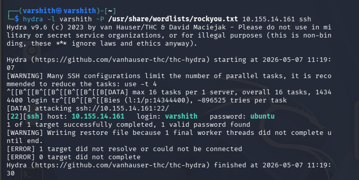
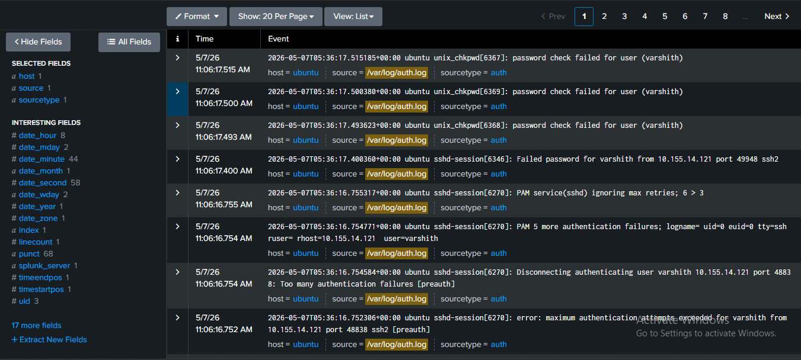
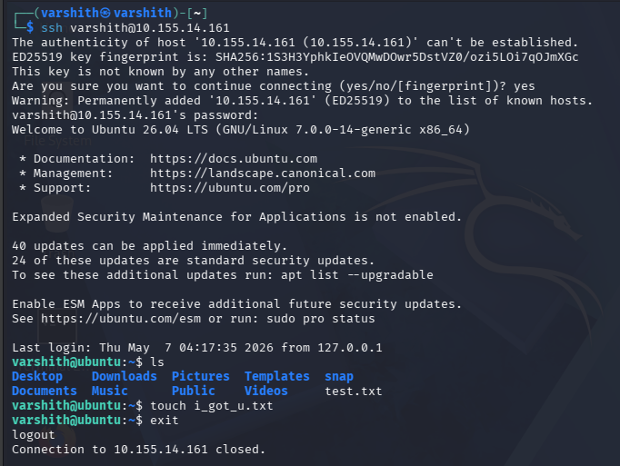
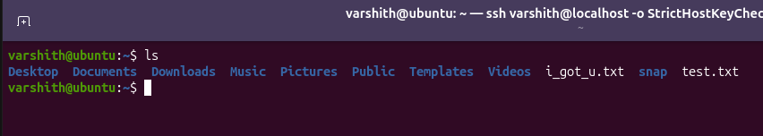
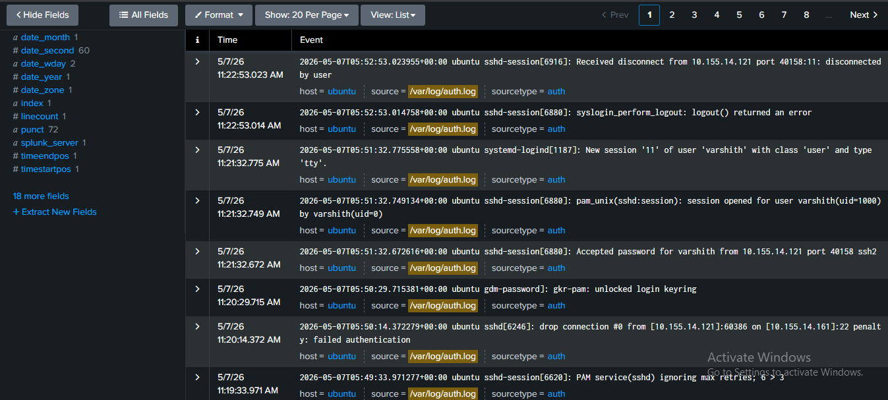

# SSH Brute Force Attack 

## Overview

SSH (Secure Shell) is a network protocol that enables secure remote access to systems. Unlike its predecessors such as Telnet or FTP, SSH encrypts the communication channel. However, when configured with password-based authentication rather than key-based authentication, SSH becomes a potential attack surface.

Attackers exploit this by brute-forcing passwords — especially when rate limiting and lockout mechanisms are not in place. Rate limiting refers to blocking an IP address after a defined number of failed login attempts. Without such controls, an attacker can iterate through a wordlist indefinitely until a valid password is found.

---

## Phase 1 — Brute Forcing the Password with Hydra

Attackers commonly use **Hydra**, a fast and parallelised login cracker, to iterate through a wordlist against the SSH service. The command targets a specific username and cycles through passwords from a wordlist such as `rockyou.txt`.

As observed below, Hydra successfully identifies a matching password for the username `varshith` on the target host `10.155.14.161`.

---

## Phase 2 — Identifying the Attack in Auth Logs

Failed login attempts are recorded in `/var/log/auth.log`. A brute force attack is characterised by a rapid succession of connection attempts from the same IP address within a short time window — behaviour that is clearly abnormal.

The logs below show repeated password check failures, PAM authentication errors, maximum authentication attempt violations, and eventual disconnection due to too many failures — all originating from the same source IP `10.155.14.121`.

This pattern, combined with cross-referencing the source IP against known network data, is sufficient to confirm a brute force attempt.

---

## Phase 3 — Attacker Gains Shell Access

Once the valid credentials are obtained, the attacker uses them to SSH into the target machine. At this point they have full interactive shell access and can read files, exfiltrate data, or perform arbitrary actions.

In this scenario, the attacker creates a file named `i_got_u.txt` on the compromised system.

---

## Phase 4 — Changes Visible on the Target Machine

The same file created by the attacker during the remote session is visible on the target machine's filesystem, confirming that the action was executed successfully on the victim host.

---

## Phase 5 — Successful Login Confirmed in Logs

The auth logs capture the exact moment the attacker's connection is accepted. A successful SSH session shows the accepted password event, a new PAM session opened for the user, and eventually a clean disconnect — all tied to the attacker's source IP `10.155.14.121`.

This provides definitive forensic confirmation that the brute-forced credentials were used to gain access.

---

## Mitigation

To prevent SSH brute force attacks, the following controls should be implemented:

**Disable password-based authentication** — Enforce key-based authentication only by setting `PasswordAuthentication no` in `/etc/ssh/sshd_config`. This removes the attack surface entirely.

**Limit failed authentication attempts** — Reduce `MaxAuthTries` in the SSH configuration to a low value (e.g., 3) to minimise the number of guesses per connection.

**Deploy Fail2ban** — Fail2ban monitors `/var/log/auth.log` and automatically updates the host firewall to block IP addresses that repeatedly fail authentication within a configurable time window and attempt threshold. This is an effective automated countermeasure against brute force activity.

