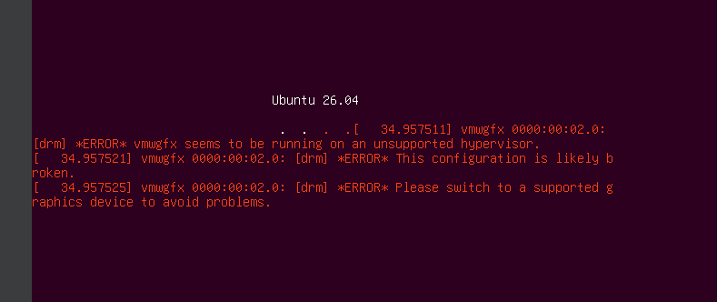
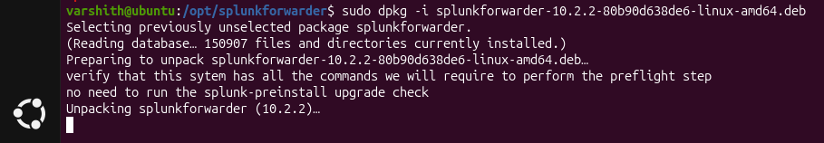
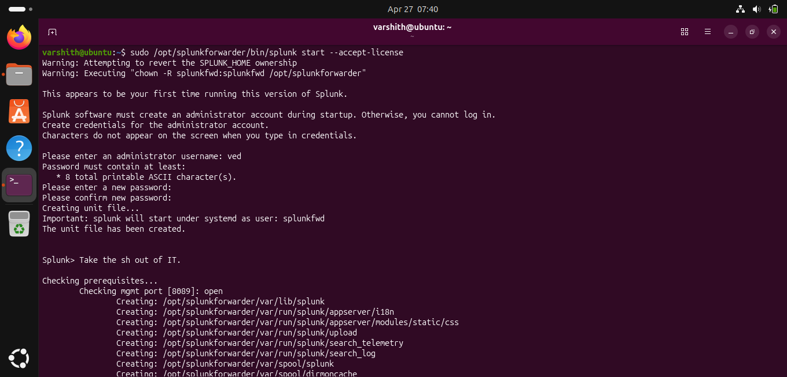
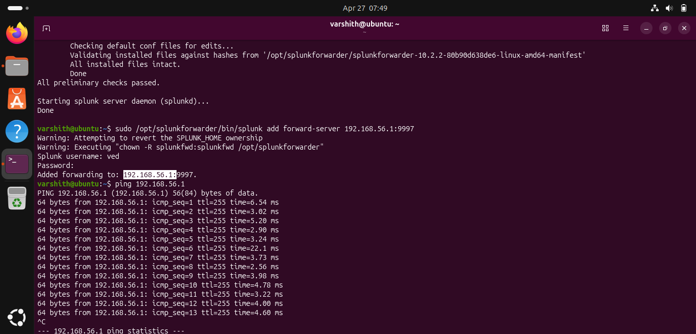
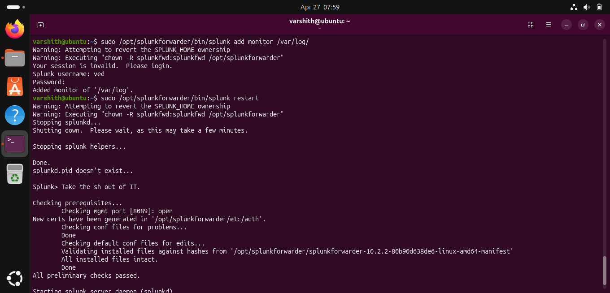
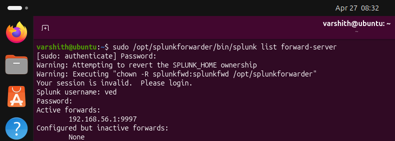
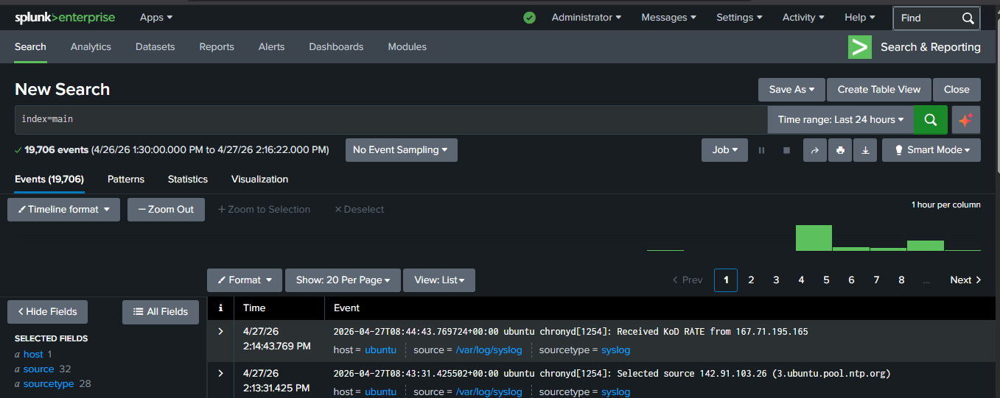

# Splunk Universal Forwarder Setup

## 1. Prerequisites and Known Issues

Before installing the Splunk Universal Forwarder on an Ubuntu virtual machine,
note a common graphics driver warning that appears during boot on VMware-based hypervisors.

**Observed Error:**

```
[drm] *ERROR* vmwgfx seems to be running on an unsupported hypervisor.
[  34.957521] vmwgfx 0000:00:02.0: [drm] *ERROR* This configuration is likely broken.
[  34.957525] vmwgfx 0000:00:02.0: [drm] *ERROR* Please switch to a supported graphics device.
```



**Resolution:** This error relates to the VMware graphics driver (vmwgfx) running under an
unsupported hypervisor configuration. It does not affect Splunk functionality and can be safely
disregarded for this setup. The system will boot and operate normally. To suppress the error
permanently, switch the VM display adapter to a supported type in your hypervisor settings.


## 2. Installing the Universal Forwarder

Download the Splunk Universal Forwarder .deb package from splunk.com and install it using dpkg.

**Command:**

```bash
sudo dpkg -i splunkforwarder-10.2.2-80b90d638de6-linux-amd64.deb
```

**Expected Output:**

```
Selecting previously unselected package splunkforwarder.
(Reading database... 150907 files and directories currently installed.)
Preparing to unpack splunkforwarder-10.2.2-80b90d638de6-linux-amd64.deb...
verify that this system has all the commands we will require to perform the preflight step
no need to run the splunk-preinstall upgrade check
Unpacking splunkforwarder (10.2.2)...
```



The installer verifies system prerequisites and unpacks the package into /opt/splunkforwarder/.


## 3. Initializing Splunk for the First Time

Start Splunk and accept the license agreement. On first run, Splunk will prompt you to create
an administrator account.

**Command:**

```bash
sudo /opt/splunkforwarder/bin/splunk start --accept-license
```

**Steps during initialization:**

- Enter a username for the administrator account (e.g., `ved`)
- Set and confirm a password (minimum 8 printable ASCII characters)
- Splunk creates a systemd unit file and starts the daemon under the `splunkfwd` user

**Expected Output (excerpt):**

```
This appears to be your first time running this version of Splunk.

Splunk software must create an administrator account during startup.
Please enter an administrator username: ved
...
Creating unit file...
Important: splunk will start under systemd as user: splunkfwd
The unit file has been created.

Splunk> Take the sh out of IT.

Checking prerequisites...
        Checking mgmt port [8089]: open
```




## 4. Configuring the Forward Server

Point the Universal Forwarder to the Splunk indexer using the add forward-server command.
Verify network connectivity to the indexer before or after this step.

**Command:**

```bash
sudo /opt/splunkforwarder/bin/splunk add forward-server 192.168.56.1:9997
```

**Expected Output:**

```
Added forwarding to: 192.168.56.1:9997.
```

**Verify connectivity:**

```bash
ping 192.168.56.1
```

```
PING 192.168.56.1 (192.168.56.1) 56(84) bytes of data.
64 bytes from 192.168.56.1: icmp_seq=1 ttl=255 time=6.54 ms
64 bytes from 192.168.56.1: icmp_seq=2 ttl=255 time=3.02 ms
```



> **Note:** Ensure port 9997 is open on the indexer and that a receiving input is configured
> in Splunk Enterprise under Settings > Forwarding and Receiving.


## 5. Adding a Log Monitor and Restarting

Configure the forwarder to monitor the /var/log/ directory and restart Splunk to apply changes.

**Commands:**

```bash
sudo /opt/splunkforwarder/bin/splunk add monitor /var/log/
sudo /opt/splunkforwarder/bin/splunk restart
```

**Expected Output:**

```
Added monitor of '/var/log'.

Stopping splunkd...
Shutting down. Please wait, as this may take a few minutes.
Done.

Splunk> Take the sh out of IT.

All preliminary checks passed.
Starting splunk server daemon (splunkd)...
```




## 6. Verifying the Forwarder Connection

Confirm that the forwarder is actively connected to the indexer.

**Command:**

```bash
sudo /opt/splunkforwarder/bin/splunk list forward-server
```

**Expected Output:**

```
Active forwards:
        192.168.56.1:9997
Configured but inactive forwards:
        None
```



The output confirms that 192.168.56.1:9997 is an active forward destination.


## 7. Confirming Data Ingestion in Splunk Enterprise

Log in to the Splunk Enterprise web interface and run a search to confirm events are received.

**Search Query:**

```
index=main
```

**Result:**

- 19,706 events indexed over the last 24 hours (4/26/26 1:30 PM to 4/27/26 2:16 PM)
- Host: `ubuntu`
- Sources include: /var/log/syslog and 31 other log files
- Source types identified: 28 distinct types (e.g., syslog)



